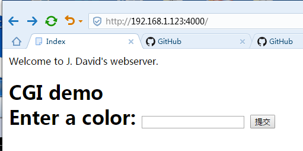

##### Tinyhttpd简介

Tinyhttpd 是J. David Blackstone在1999年写的一个不到 500 行的超轻量型 Http Server，用来学习非常不错，可以帮助我们真正理解服务器程序的本质。官网:http://tinyhttpd.sourceforge.net


#####  修改说明

添加windows支持，CentOS7编译需要在#include <sys/types.h>前添加

```c++
#define __USE_BSD
#include <sys/types.h>
```

##### 每个函数的作用

```
     accept_request:  处理从套接字上监听到的一个 HTTP 请求，在这里可以很大一部分地体现服务器处理请求流程。

     bad_request: 返回给客户端这是个错误请求，HTTP 状态吗 400 BAD REQUEST.

     cat: 读取服务器上某个文件写到 socket 套接字。

     cannot_execute: 主要处理发生在执行 cgi 程序时出现的错误。

     error_die: 把错误信息写到 perror 并退出。

     execute_cgi: 运行 cgi 程序的处理，也是个主要函数。

     get_line: 读取套接字的一行，把回车换行等情况都统一为换行符结束。

     headers: 把 HTTP 响应的头部写到套接字。

     not_found: 主要处理找不到请求的文件时的情况。

     sever_file: 调用 cat 把服务器文件返回给浏览器。

     startup: 初始化 httpd 服务，包括建立套接字，绑定端口，进行监听等。

     unimplemented: 返回给浏览器表明收到的 HTTP 请求所用的 method 不被支持。
```

##### 程序说明

c语言实现HTTP1.0协议，每个socket建立一个线程。

默认访问htdocs文件夹下面的index.html网页,
color.cgi需要perl支持，win下未做兼容处理,具体见函数execute_cgi。




##### 服务器回答HTTP1.0头

```c
/**********************************************************************/
/* Return the informational HTTP headers about a file. */
/* Parameters: the socket to print the headers on
*             the name of the file */
/**********************************************************************/
void headers(int client, const char *filename)
{
	char buf[1024] = { 0 };
	(void)filename;  /* could use filename to determine file type */

	strcpy(buf, "HTTP/1.0 200 OK\r\n");
	send(client, buf, strlen(buf), 0);
	strcpy(buf, SERVER_STRING);
	send(client, buf, strlen(buf), 0);
	sprintf(buf, "Content-Type: text/html\r\n");
	send(client, buf, strlen(buf), 0);
	strcpy(buf, "\r\n");
	send(client, buf, strlen(buf), 0);
}
```

##### 服务器回答xxx.html文件

```c
/**********************************************************************/
/* Put the entire contents of a file out on a socket.  This function
* is named after the UNIX "cat" command, because it might have been
* easier just to do something like pipe, fork, and exec("cat").
* Parameters: the client socket descriptor
*             FILE pointer for the file to cat */
/**********************************************************************/
void cat(int client, FILE *resource)
{
	char buf[1024] = { 0 };

	fgets(buf, sizeof(buf), resource);
	while (!feof(resource))
	{
		send(client, buf, strlen(buf), 0);
		fgets(buf, sizeof(buf), resource);
	}
}
```


